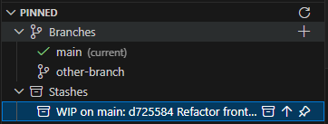

# Git Pin

A Visual Studio Code extension that allows you to pin your favorite Git branches and stashes for quick access and easy switching.



## Features

- **Pin Branches**: Pin any Git branch to keep it easily accessible
- **Pin Stashes**: Pin Git stashes to quickly find and apply them later
- **Quick Checkout**: Click on a pinned branch to quickly check it out
- **Quick Apply**: Click on a pinned stash to apply it to your working directory
- **Visual Indicators**: See which branch is currently active and which branches/stashes still exist
- **Persistent Storage**: Pinned branches and stashes are stored per workspace
- **Easy Management**: Pin and unpin branches and stashes with simple commands

## Usage

### Pin a Branch

1. In the "Pinned" view, hover the **Branches** section and click the **`+`** icon
2. Select the branch you want to pin from the list
3. Or use the Command Palette: `Git Pin: Pin Branch`

Alternatively, switch to the branch you want to pin and use the Command Palette: `Git Pin: Pin Current Branch`

### Checkout a Pinned Branch

- Expand **Branches** inside the "Pinned" view and click a branch to check it out

### Unpin a Branch

- Click the unpin icon next to a pinned branch in the view
- Or use the Command Palette: `Git Pin: Unpin Branch` and select from the list

### Pin a Stash

1. In the "Pinned" view, hover the **Stashes** section and click its pin icon
2. Select the stash you want to pin from the list
3. Or use the Command Palette: `Git Pin: Pin Stash`

### Apply a Pinned Stash

- Expand **Stashes** inside the "Pinned" view
- Click the archive icon (apply) or arrow icon (pop) on a stash item
- Left icon applies the stash (keeps it in the stash list)
- Right icon pops the stash (applies and removes it)
- The stash will be applied to your working directory (equivalent to `git stash apply` or `git stash pop`)

### Unpin a Stash

- Click the unpin icon next to a pinned stash in the view
- Or use the Command Palette: `Git Pin: Unpin Stash` and select from the list

### Refresh the View

- Click the refresh icon in the view title bar
- The view automatically refreshes when you switch branches

## View

The extension provides a single **Pinned** view in the Source Control sidebar with two sections:

### Branches

Shows your pinned branches with:

- ✅ **Current branch** - marked with a green check icon and "(current)" label
- ⚠️ **Missing branches** - branches that no longer exist, marked with a warning icon
- 🌿 **Available branches** - branches that exist and can be checked out

### Stashes

Shows your pinned stashes with:

- 📦 **Available stashes** - stashes that exist and can be applied, showing stash index
- ⚠️ **Missing stashes** - stashes that no longer exist, marked with a warning icon

## Commands

This extension contributes the following commands:

**Branch Commands:**

- `git-pin.pinBranchFromList` - Pick any branch from a list and pin it
- `git-pin.pinCurrentBranch` - Pin the currently checked-out branch
- `git-pin.unpinBranch` - Unpin a branch
- `git-pin.checkoutBranch` - Checkout a pinned branch
- `git-pin.refresh` - Refresh the unified pinned view

**Stash Commands:**

- `git-pin.pinStash` - Pin a Git stash
- `git-pin.unpinStash` - Unpin a stash
- `git-pin.applyStash` - Apply a pinned stash (keeps stash)
- `git-pin.popStash` - Pop a pinned stash (applies and removes)

## Requirements

- Visual Studio Code 1.80.0 or higher
- Git must be installed and available in your PATH
- A workspace with a Git repository

## Installation

### From Source

1. Clone this repository
2. Run `npm install` to install dependencies
3. Run `npm run compile` to compile the TypeScript code
4. Press F5 to open a new VS Code window with the extension loaded

### Package the Extension

```bash
npm install -g @vscode/vsce
vsce package
```

This creates a `.vsix` file that you can install manually:

```bash
code --install-extension git-pin-0.2.4.vsix
```

## Extension Settings

This extension stores pinned branches and stashes in the workspace state. No additional configuration is required.

## Known Issues

- The extension requires Git to be available in the system PATH
- Remote branches are supported but may show as "not found" if not fetched locally

## Contributing

If you find any bugs or have feature requests, please file an issue on the GitHub repository.

## License

This extension is released under the [MIT License](LICENSE.md).
